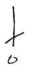
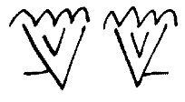
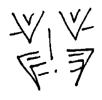
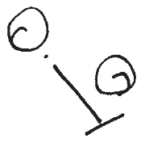

# ASL Write ASCII (AWA)

### First specify a body mark with it's name or a single letter

|name               |short name|single letter|
|:------------------|:--------:|:-----------:|
|`forehead`         |          |`f`          |
|`chin`             |          |`c`          |
|`neck`             |          |`n`          |
|`shoulder`         |          |`s`          |
|`arm`              |          |`a`          |
|`waist`            |          |`w`          |
|`back-of-head`     |`back`    |`b`          |
|`head`             |          |`h`          |
|`forehead-to-nose` or<br/>`upper-face`|`upper`|`u`|
|`nose`             |          |`o`          |
|`nose-to-chin` or<br/>`lower-face`|`lower`|`l`|
|`torso`            |          |`t`          |
|`knee`             |          |`k`          |

### Next specify a location on the mark in square brackets
The locations are given as compass points, or left empty for central
```
[NW]  [N]  [NE]
 [W]  []   [E]
[SW]  [S]  [SE] 
```
Optionally you can use `A`bove, `B`elow, `R`ight, `L`eft.
```
[AL]  [A]  [AR]
 [L]  []   [R]
[BL]  [B]  [BR] 
```
This can optionally be given as an angle in degrees for more precision, with `[0]` and `[360]` being equivalent to `[N]`, and `[90]` being equivalent to `[E]`

### Now specify a hand shape by its name
Hand shapes are named as in the [HANDSPEAK ASL handshape chart](https://www.handspeak.com/learn/438/), like `5-num` for the  handshape, and `2-claw` for the  handshape.

A capital `L` or `R` can be added to any symbol to specify if it is a right or left handed handshape, and handshapes are right-handed by default. So `5-num` and `R 5-num` are the same handshape and `L 5-num` is the left handed variant. 

This can be changed by specifying:
```
_default-hand = L
```
at the top of your document. You can also say `_default-hand = R` to be explicit, but it is not required.

### Now you can add diacritics and palm orientation marks to your handshapes

The diacritics are single symbols that appear after the handshape:
- `^` – hinge
- `@` – rotational
- `~` – flutter
- `"` – rattle
- `_` - fingers up
- `|` - fingers out

For example "first", , can be written as `1-num @` meaning, in neutral space, create the `1-num` handshape, and rotate

### Groups

It is important to mention that a word in AWA is made up of an arbitrary number of "groups". Each group is relative the "root group". Each group can contain a list of body marks, handshapes, or extramanual marks.

Groups are specified with parentheses. Note single symbols do not need parentheses, as seen in the "first" example above. For example "wait" has two groups, `(5-num ~)` and `(L 5-num ~)` which must be grouped into `(5-num ~)[R](L 5-num ~)`. This encodes the following symbol: . There are multiple encoding for every symbol, for example you may prefer to think the "wait" is `(L 5-num ~)[L](5-num ~)`

Lets look at a more complex symbol, and break down it's groups. Let's look at "want", . For now I'm not going to show how to include the movement marks, so we will just build the 2 by 2 grid of handshapes. Specifically the symbol: . We already know `5-num` and the other handshape, , is called `5-claw`

We have four groups, `(R 5-num)`, `(L 5-num)`, `(R 5-claw)`, `(L 5-claw)`. For me the natural grouping is to group the top and bottom hands together, this will also make adding the movement marks easier later, but you could group the left and right hands together. So the top group is written `(R 5-num)[R](L 5-num)`, and the bottom group is written `(R 5-claw)[R](L 5-claw)`. We can then group these together! 

```
((R 5-num)[R](L 5-num))[B]((R 5-claw)[R](L 5-claw))
```

Long symbols like this can be difficult to parse when written this way, AWA ignores extra spaces and line breaks inside groups so you can write this as:
```
( (R 5-num)[R](L 5-num) )
[B]
( (R 5-claw)[R](L 5-claw) )
```
or you can line up the groups, so the code "looks like" the symbol:
```
( (R 5-num)  [R] (L 5-num)  )
             [B]
( (R 5-claw) [R] (L 5-claw) )
```

### Lets look at movement marks, so we can finish our "want" symbol!

When connecting two groups you can annotate the connection with a movement mark! In the previous section we said 
```
( (R 5-num)  [R] (L 5-num)  )
             [B]
( (R 5-claw) [R] (L 5-claw) )
```
encodes this symbol: . But to get to the correct "want" symbol we must connect the upper and lower sections with a downward move. The below indicator, `[B]`, tells AWA to move the next group below the current group, so you can just add the arrow type you want in the brackets! So for  you would say:
```
( (R 5-num)  [R] (L 5-num)  )
             [B,-.]
( (R 5-claw) [R] (L 5-claw) )
```
Indicating a straight line with a single dot as the arrow head. For two dots the arrow would look like `-..`, and for three `-...`. A "firm-point" arrow would be done with `-!`, and a "turn mark" is `->.`. For a vertical arrow add a `|` to the front of any arrow, so support () would be written:
```
(L s)[TL,|-.](R s)
```

### More control over positioning
If you have used ASLwrite before you know that the exact positioning of symbols can be important. What if we want to write "support" closer to the way is is written by Adrean Clark, . This can be done using blank groups and giving a distance to the move! 

### A note about diacritics
Now that you know how groups work, I can tell you a secret! Above I showed you that diacritics are written in the same group as the hand shape as in, `1-num @`. This is a shorthand for putting the diacritic in another group above the hand shape. So `1-num @` is the same as `(1-num)[A](@)` 